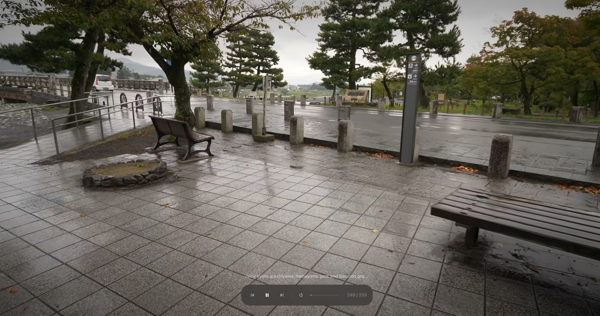
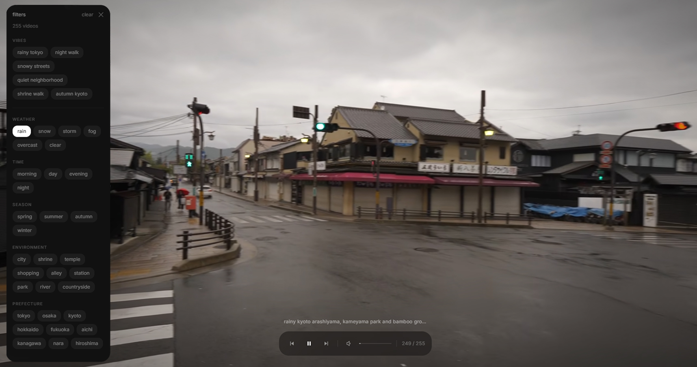

<div align="center">
    
</div>

<hr />

ambient japan street walks for coding and relaxing.

## what it is

shizuka plays rambalac's japan walking videos as a continuous ambient backdrop. filter by weather, time, season, environment, and prefecture. use vibe presets for quick vibes.

## screenshots



## setup

```bash
npm install
npm run dev
```

open [http://localhost:3000](http://localhost:3000).

## youtube api

to fetch the full channel library:

1. get a youtube data api v3 key from google cloud console
2. copy `.env.local.example` to `.env.local`
3. paste your key as `NEXT_PUBLIC_YOUTUBE_API_KEY`

## deploy to vercel

```bash
npx vercel
```

or connect the repo in the vercel dashboard. add `NEXT_PUBLIC_YOUTUBE_API_KEY` in environment variables if you have one.

## how it works

- videos are fetched from the rambalac channel via youtube api (or seed data)
- titles and descriptions are parsed with a lightweight nlp tag extractor
- fuse.js handles fuzzy search across the video library
- zustand persists filter state and mute preference
- metadata is cached in localstorage for 24h to reduce api calls

## controls

- hover to show ui / controls
- click filters to open sidebar
- use vibe presets for quick moods
- click active filter chips to remove them
